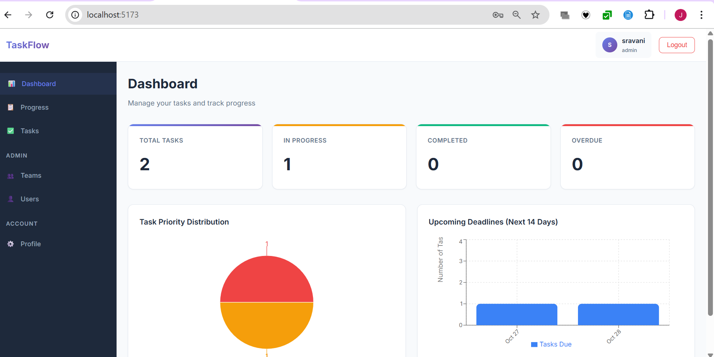
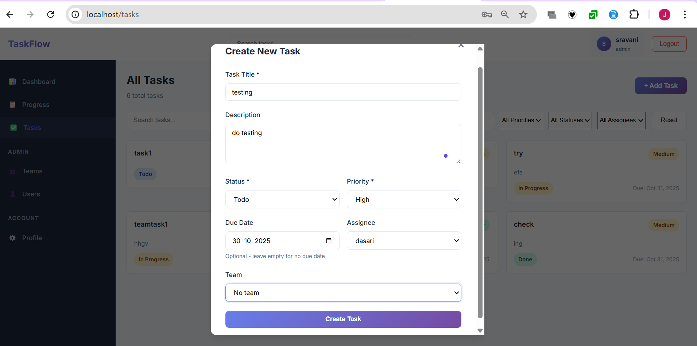

# Task Management Tool

## Project Overview
A full-stack task management application with Kanban board, JWT authentication, role-based access control, and team collaboration features built with React, Node.js, Express, and PostgreSQL.

## live link : https://drishya-project.vercel.app/

## Features Implemented
✅ User authentication (Sign-up/Login with JWT)
✅ Role-based access (Admin and Member roles)
✅ Kanban board with drag-and-drop (Todo/In Progress/Done)
✅ Task CRUD operations (Create, Read, Update, Delete)
✅ Task filtering by priority, assignee, status
✅ Task search by title/description
✅ Dashboard with charts ( pie chart for priority, bar chart for deadlines)
✅ Team management
✅ Responsive design for mobile/desktop
✅ Form validation (due date, required fields)
✅ Real-time updates across application
✅ Dockerized deployment

## Tech Stack

### Frontend
- React 18
- React Router
- Axios
- Drag-and-drop library
- Chart.js

### Backend
- Node.js & Express
- PostgreSQL
- JWT authentication
- Bcrypt password hashing
- Rate limiting

### DevOps
- Docker
- Docker Compose
- Nginx

## Prerequisites
- Docker Desktop
- Git

## Quick Start with Docker

### 1. Clone Repository

https://github.com/jayasridasari/drishya-project.git

cd drishya-project

### 2. Start Application

docker-compose up -d

### 3. Initialize Database

docker cp schema.sql drishya-db:/schema.sql
docker exec -it drishya-db psql -U taskuser -d drishyadb

In psql prompt:

CREATE EXTENSION IF NOT EXISTS "uuid-ossp" WITH SCHEMA public;
\i /schema.sql
ALTER DATABASE drishyadb SET search_path TO public;
\q

### 4. Restart Backend

docker-compose restart backend

### 5. Access Application
Open browser: http://localhost

## Default Test Users
| Email | Password | Role |
|-------|----------|------|
| admin@example.com | admin123 | Admin |
| user@example.com | user123 | Member |

## API Endpoints

### Authentication
- POST /api/auth/register - Register user
- POST /api/auth/login - Login user
- POST /api/auth/logout - Logout user
- GET /api/auth/me - Get current user

### Tasks
- GET /api/tasks - Get all tasks
- POST /api/tasks - Create task
- PUT /api/tasks/:id - Update task
- DELETE /api/tasks/:id - Delete task

### Teams
- GET /api/teams - Get all teams
- POST /api/teams - Create team

### Admin (Admin role only)
- GET /api/users - List all users
- DELETE /api/users/:id - Delete user

## Screenshots

### Login Page

### Kanban Board

### Dashboard

### Task Form

##Development Process

The development of the Task Management Tool followed a full-stack approach using React for the frontend, Node.js/Express for the backend, and PostgreSQL for the database. I started by carefully studying the project requirements to identify all the functional features needed, such as user authentication, Kanban-style task management, dashboard visualization, and team collaboration.

I structured the application into separate frontend and backend directories for maintainability. For the frontend, I built reusable React components and used React Router for navigation. Key features like user registration, login, and a drag-and-drop Kanban board were implemented using React and suitable libraries. For data visualization on the dashboard, I used Chart.js.

On the backend, I set up RESTful APIs with Express and secured them with JWT-based authentication and role-based access. Passwords were hashed using bcrypt, and rate limiting was implemented for security. The PostgreSQL database schema was designed to include users, tasks, teams, and related features.

Throughout development, I ensured thorough testing of all functionalities. Once the features were stable, I Dockerized the entire application using Docker Compose, enabling seamless multi-container orchestration. Finally, I prepared a comprehensive README file and supporting screenshots as part of the final documentation.

##Challenges Faced and Solutions Implemented
Database Connection Issues in Docker:
Initially, my Node.js backend couldn't connect to PostgreSQL in Docker. The problem was caused by the backend connecting to localhost instead of the Docker network.
Solution: I set the DATABASE_URL environment variable in docker-compose.yml to ensure the backend connected correctly using the service name.

Schema Search Path Not Set in PostgreSQL:
After importing the database schema, my tables weren't visible in psql.
Solution: I explicitly set the search path to the public schema using ALTER DATABASE drishyadb SET search_path TO public; so queries would find tables correctly.

JWT Authentication Failures:
I encountered errors like "secretOrPrivateKey must have a value" because the JWT_SECRET was missing or misconfigured.
Solution: I added the correct secrets to my docker-compose environment and made sure special characters like $ were properly escaped.

Docker Compose Indentation and Environment Variable Issues:
At one point, containers wouldn't start due to YAML formatting errors and duplicate entries in docker-compose.yml.
Solution: I carefully checked indentation, eliminated duplicate keys, and restructured services as required for Docker Compose best practices.

Real-Time UI Sync:
Implementing real-time updates across the Kanban board and dashboard was challenging due to state management requirements.
Solution: I used React state and effect hooks and tested flows extensively to ensure UI consistency.

Frontend/Backend Communication During Deployment:
When going from local to cloud deployment, CORS and API base URLs often caused communication issues.
Solution: I updated API URLs in the frontend to match the deployed backend endpoints and configured CORS settings for production.

Final Cloud Deployment:
Ensuring everything ran smoothly on a cloud platform like Render required attention to environment variables, build settings, and importing the database schema remotely.
Solution: I followed the platform guidelines, used environment variable settings in the dashboard, and imported the schema using remote psql commands.